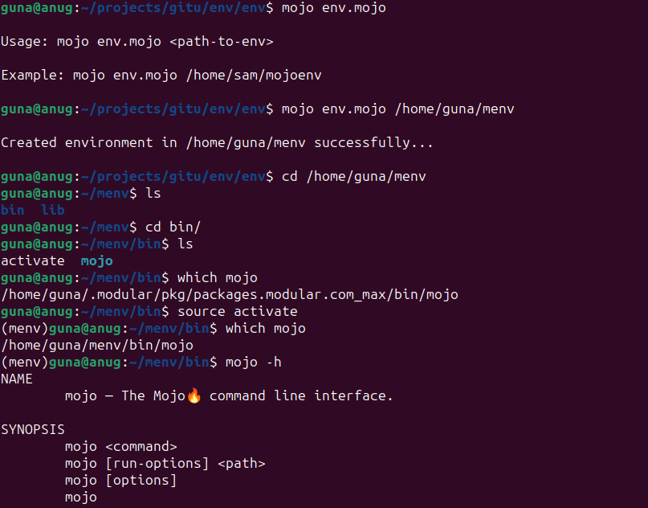

### env.🔥
env is a virtual enviroment tool for mojo.

## prerequisites

Make sure you have installed and [configured mojo on your environment](https://docs.modular.com/mojo/manual/get-started/index.html)

once mojo is installed and configured open bash and run

```bash
git clone https://github.com/mojolibs/env.git && cd env/env
```

<p>
  
</p>